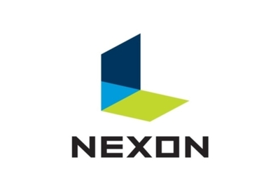
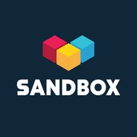

## [오디오 플랫폼 FLO]Python 기반 빅데이터 처리 개발자

### ⚾주요 업무

- #### FLO 서비스에서 발생하는 재생 로그들을 취합하여, 권리자들에게 정산 해주는 시스템을 개발 및 운영합니다.

- #### 이용권/정산 개발팀은 상품의 생성부터 판매 후, 저작권자들에게 정산까지 콘텐츠 플랫폼의 이용과 관련된 전반적인 업무를 총괄합니다.

### 🥎 자격 요건

- #### Python을 사용하여 웹서비스를 개발, 운영한 경험이 있는 분

- #### 웹서비스를 컨테이너기반 인프라에 배포, 운영한 경험이 있는 분

- #### 일반적인 웹 서비스 아키텍쳐에 대한 이해 및 RESTful API 설계 역량이 있는 분

- #### 긍정적이고 원활한 커뮤니케이션 스킬 소유자

### 🏀 우대 사항

- #### Devops 환경 기반 서비스를 운영 경험이 있는 분

- #### Presto, Hive, Kubernetes 같은 빅데이터 플랫폼과 클라우드 환경에 익숙한 분

- #### 코드리뷰 및 문서화에 익숙하신 분

### ✔링크 : [FLO](https://career.programmers.co.kr/job_positions/12321?by_theme=true)

---

---

## [인텔리전스랩스] (넥슨코리아)선행개발실 백엔드 개발자(Go/Python)

### ⚾주요 업무

- #### 실시간 대용량 트래픽을 안정적으로 받을 수 있는 분산 구조의 고성능 백엔드 서버 설계/개발 및 운영

- #### 실제 서비스 환경에서 발생하는 각종 오류나 장애상황을 빠르게 감지하고 투명하게 원인을 파악하고 수정할 수 있는 환경 구축

### 🥎 자격 요건

- #### Linux 환경에서 Python, Go 등의 언어로 백엔드 서버 개발이 가능하신 분

- #### 자료구조, 알고리즘, 데이터베이스, 분산처리 등 컴퓨터 공학의 기초지식을 지니신 분

- #### 주도적으로 문제를 해결하고, 새로운 기술 도입에 거부감이 없으신 분

- #### 원활한 커뮤니케이션으로 동료들과 즐겁게 일할 수 있으신 분

### 🏀 우대 사항

- #### 클라우드 환경(AWS, Azure, GCP)에서 업무 경험이 있으신 분

- #### 높은 품질의 소프트웨어 개발을 위한 방법론에 관심이 많은 분

- #### 시스템 아키텍쳐의 설계 경험이 있으신 분

- #### 소프트웨어 개발팀을 리딩한 경험이 있으신 분

- #### Kubernetes 혹은 다른 컨테이너 기반의 서비스 개발 및 운영 경험이 있으신 분

### ✔링크 : [넥슨코리아](https://career.programmers.co.kr/job_positions/12664?by_theme=true)

---

---

## [버킷플레이스] (오늘의집)Software Engineer, Backend, Ads

.jpg)

### ⚾주요 업무

- #### 애플리케이션 컴포넌트 설계, 개발, 테스트 및 운영

- #### 광고 및 제휴 서비스 운영을 위한 Back office 개발 및 개선

- #### 서비스 아키텍처 설계부터 출시까지 전 과정 참여

- #### Spring Framework를 사용한 서비스 개발 및 운영

### 🥎 자격 요건

- #### 컴퓨터공학 전공 혹은 그에 준하는 전공 및 지식을 보유하신 분

- #### Kotlin, Java, Go 등 하나 이상의 프로그래밍 언어에 전문성이 있는 분

### 🏀 우대 사항

- #### 소규모 프로젝트의 리딩 경험이 있는 분

- #### 광고 도메인에 대한 이해 및 개발 경험이 있는 분

- ####  서비스간 데이터 통신 방법에 대한 이해 및 개발 경험이 있는 분

- #### 대용량 트래픽 처리에 대한 이해 및 서비스 경험이 있는 분

- #### 전체 SDLC(소프트웨어 생명주기)에 대한 경험이 있는 분

- #### 애자일 스프린트, MVP 단위 개발 프로세스에서의 개발 경험이 있는 분

- #### AWS와 같은 Public Cloud 작업 경험이 있는 분

- #### 콘텐츠, 커머스, 인테리어 산업에 대한 높은 관심과 이해도를 보유하신 분

### ✔링크 : [오늘의집](https://career.programmers.co.kr/job_positions/10683)

---

---

## [토스뱅크] Frontend Developer]

### ⚾주요 업무

- #### 계좌 개설, 카드 신청, 저축, 대출 실행과 같은 토스뱅크의 다양한 웹 서비스를 개발해요.

- #### 토스뱅크의 생산성을 극대화하는 자동화 도구를 개발해요.

- #### 완벽한 사용자 경험을 목표로 프론트엔드 개발 환경을 개선해요.

- #### TDS 등 토스 공통 라이브러리 제작에 참여할 수 있어요.

- #### 토스뱅크 홈페이지, 법인 사용자 서비스와 같은 공통 서비스를 개발해요.

### 🥎 자격 요건

- #### React, Vue, Angular 등 SPA 프레임워크 사용에 능숙하신 분이 좋아요.

- #### HTML, CSS, JavaScript에 대한 이해가 깊은 분이 좋아요.

- #### UI/UX에 대해 높은 가치를 두고 있는 분이 좋아요.

- #### Git 등의 분산 버전 관리 시스템 이용에 능숙한 분이면 좋아요.

- #### Frontend Operation 시스템(CI, CD 등)의 자동화, 편의성에 항상 관심을 가지고 발전시키고 싶은 분들과 함께하고 싶어요.

### 🏀 우대 사항

- #### **이력서는 이렇게 작성하시는 걸 추천해요**

  - ##### TypeScript, Flow를 이용한 JavaScript 정적 타입 분석 경험이 있는 분이면 좋아요.

  - ##### 서버 사이드 렌더링(SSR) 및 모바일 앱 내 웹앱 개발 경험이 있는 분이면 좋아요.

  - ##### 반응형 디자인, 웹 접근성, 웹 표준을 고려한 UI 개발 경험이 있는 분이면 좋아요.

  - ##### 테스트 및 배포 자동화 경험이 있는 분이면 좋아요.

  - ##### Webpack 등 모듈 번들러를 능숙하게 사용하시는 분이면 좋아요.

  - ##### 사용자 경험에 대한 높은 이해도를 갖고, 문제를 해결하는 분과 함께하고 싶어요.

### ✔링크 : [토스뱅크](https://career.programmers.co.kr/job_positions/11441)

---

---

## [샌드박스네트워크] [Content Tech] 백엔드 개발자

### ⚾주요 업무

- #### Back-end 유지 보수

- #### 유튜브/트위치 등 데이터를 활용한 신규 서비스 개발

### 🥎 자격 요건

- #### 웹 서비스 아키텍처에 대한 전반적인 이해

- #### 데이터 베이스에 대한 이해

- #### **Python** 사용경험 필수

- #### 서비스 백엔드 서버 개발 및 운영 경험

- #### 웹 서비스 아키텍처에 대한 전반적인 이해

### 🏀 우대 사항

- #### AWS, GCP 등 Cloud 사용 경험

- #### Node.js, Java 사용 경험

- #### 웹/앱 서비스 운영 경험

- #### 3년 이상 경력자 우대

- #### 포트폴리오, 소스코드, 프로젝트 관련 자료 첨부 시 우대 (PDF)

- #### 등록장애인 및 보훈대상자 우대

### ✔링크 : [샌드박스](https://career.programmers.co.kr/job_positions/5864)

---

---

